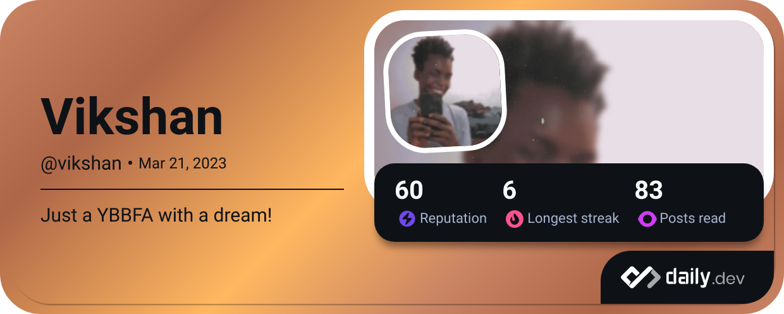

  

  

  
  &#8287;&#8287;&#8287;&#8287;&#8287;
  
  &#8287;&#8287;&#8287;&#8287;&#8287;
  
  &#8287;&#8287;&#8287;&#8287;&#8287;
  
  &#8287;&#8287;&#8287;&#8287;&#8287;
  
  &#8287;&#8287;&#8287;&#8287;&#8287;
  

  

  <pre align="center">
   ┌──────────────────────────┐
   │   Hey there, gamers! 👋  │
   └──────────────────────────┘
  <em>
    I'm <b>Vikshan</b>, a Kenyan full-stack developer and 
    enthusiast about Discord and breaking things!
    Currently a third year <b>Education(Science)</b> undergraduate 
    majoring in math and physics at <a href="https://www.ku.ac.ke"><b>Kenyatta University</b>, Kenya</a>.
  </em>
  </pre>

 

  
  <h1>🎮 About Me 🎮 </h1>
  

I am highly interested in growing my knowledge in computer science through more projects,
internships and positions. Check out my [blog posts](https://blog.vikshan.tech) and reach out via
[email](mailto:info@vikshan.tech)!

---

  <pre align="center">
┌──────────── PLAYER STATS ────────────┐
│ 🧞 Tech Enthusiast since childhood   │
│ 🔭 Working on discord.js bots        │
│ 👯 Open for collaboration            │
│ 💡 Open Source Contributor           │
│ 🤝 Looking to help others            │
│ 😄 Pronouns: he/him                  │
│ ⚡ Currently building great things    │
└──────────────────────────────────────┘
  </pre>

 

    <table>
      <tr>
        <th colspan="5" align="center">⚔️ Tech Stack ⚔️</th>
      </tr>
      <tr align="center">
        <td>
          <a href="https://www.javascript.com/" target="_blank">
             
            JavaScript
          </a>
        </td>
        <td>
          <a href="https://www.typescriptlang.org/" target="_blank">
             
            TypeScript
          </a>
        </td>
        <td>
          <a href="https://bun.sh/" target="_blank">
             
            Bun
          </a>
        </td>
        <td>
          <a href="https://astro.build/" target="_blank">
             
            Astro
          </a>
        </td>
        <td>
          <a href="https://nodejs.org/en" target="_blank">
             
            Node.js
          </a>
        </td>
      </tr>
      <tr>
        <th colspan="5" align="center">🎯 Learning Quest 🎯</th>
      </tr>
      <tr align="center">
        <td>
          <a href="https://flutter.org/en" target="_blank">
             
            Flutter
          </a>
        </td>
        <td>
          <a href="https://dart.org/en" target="_blank">
             
            Dart
          </a>
        </td>
        <td>
          <a href="https://www.w3schools.com/html/" target="_blank">
             
            HTML5
          </a>
        </td>
        <td>
          <a href="https://tailwindcss.com/" target="_blank">
             
            Tailwind
          </a>
        </td>
        <td>
          <a href="https://www.tensorflow.org/" target="_blank">
             
            TensorFlow
          </a>
        </td>
      </tr>
    </table>
  

 

---

  
  <h1>🏆 Achievement Unlocked: Github Stats 🏆</h1>
  

  

 

  ═══════════════ ACHIEVEMENTS ═══════════════

 

  

 
 

  ═══════════════ 🎮 Connect & Support Me 🎮 ═══════════════

 

  
  &#8287;&#8287;
  
  &#8287;&#8287;
  
  &#8287;&#8287;
  
  &#8287;&#8287;
  
  &#8287;&#8287;
  
  &#8287;&#8287;
  
  &#8287;&#8287;
  

  
   
   
  Created with 🖤, 🎶 & ☕ by <a href="https://github.com/vixshan">Vikshan</a>
   

  

